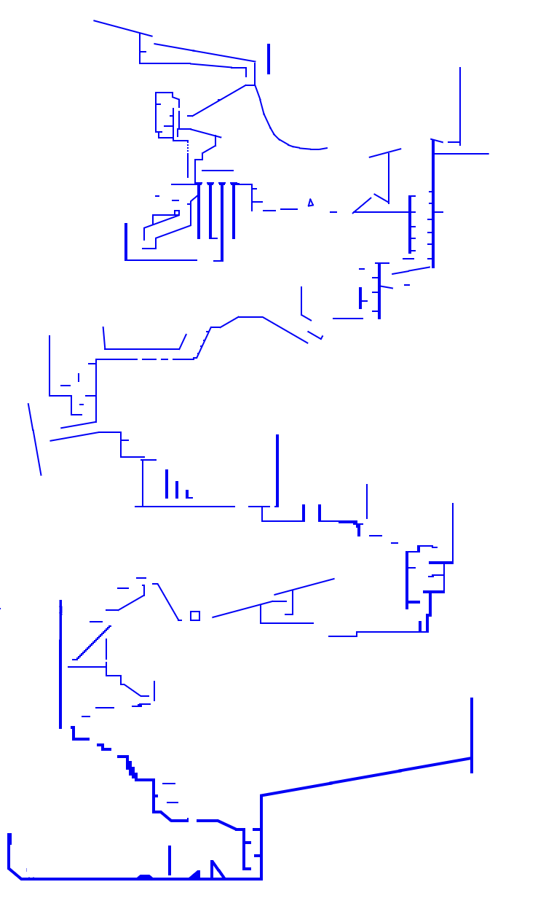

# Untitled triangle game

ik what to call it

basic platforming game similar to getting over it  
pretty cool to work on  

dont read the code it's to complecated for anyone in the world to understand

demo here - https://aeolus-1.github.io/triangleGame   

s,d,ArrowLeft,ArrowRight = Move Left/Right

w, Space, ArrowUp = Jump

s, ArrowDown = Duck  

p = chat input (& commands)

y = open map

i = chrome overlay

Editor:  
click + drag = Draw block  
<, > = Rotate Block  
Arrow Keys = Move camera  
Shift + Arrow Keys = move selected block  
Digits (1, 2, 3...) = switch block type  

Music by nokia

controbutions by Serfonium  
networking and server by nekoify

Game map  

.

